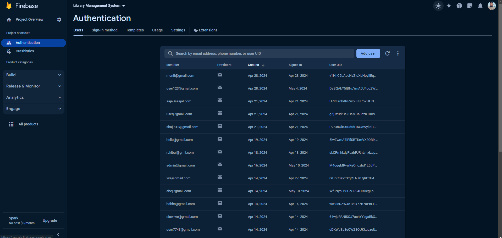

# Android Project: Library Management System Using Android Jetpack Compose and Room Database (CRUD)

## Overview

This project is a Library Management System developed using Android Jetpack Compose, Room Database and Firebase authentication. It allows users to perform CRUD (Create, Read, Update, Delete) operations on books stored in the database. The app provides an intuitive user interface for managing library resources.

## Features

### Admin
- Add new books with title and author information
- View list of all books in the library
- Update existing book information
- Delete books from the library
- Upload book images
- Camera permission
- dropdown menu, alert dialog, bottom sheet, nav drawer etc.
- Firebase authentication (Registration, User login, Admin login)

### Users
- Checkout Book
- Return Book
- View book and author list
- Authentication

## Getting Started

To run this project locally, follow these steps:

1. Clone or download this repository to your local machine.
2. Open the project in Android Studio.
3. Build and run the project on an Android device or emulator.

## Requirements

- Android Studio 4.0 or higher
- Android SDK with minimum API level 21 (Android 5.0 Lollipop)

## Screenshots

    
    
    
    

    
    
    
    

    
    
    
    

    
    
    
    

    

## License

This project is licensed under the [MIT License](./LICENSE).
